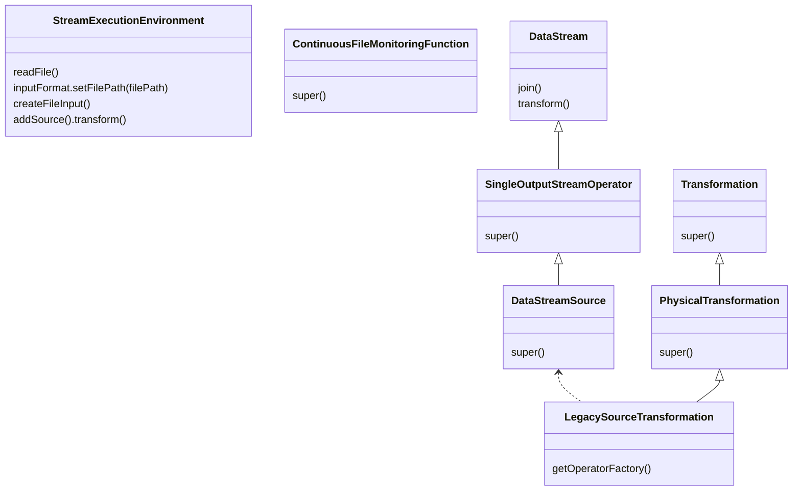
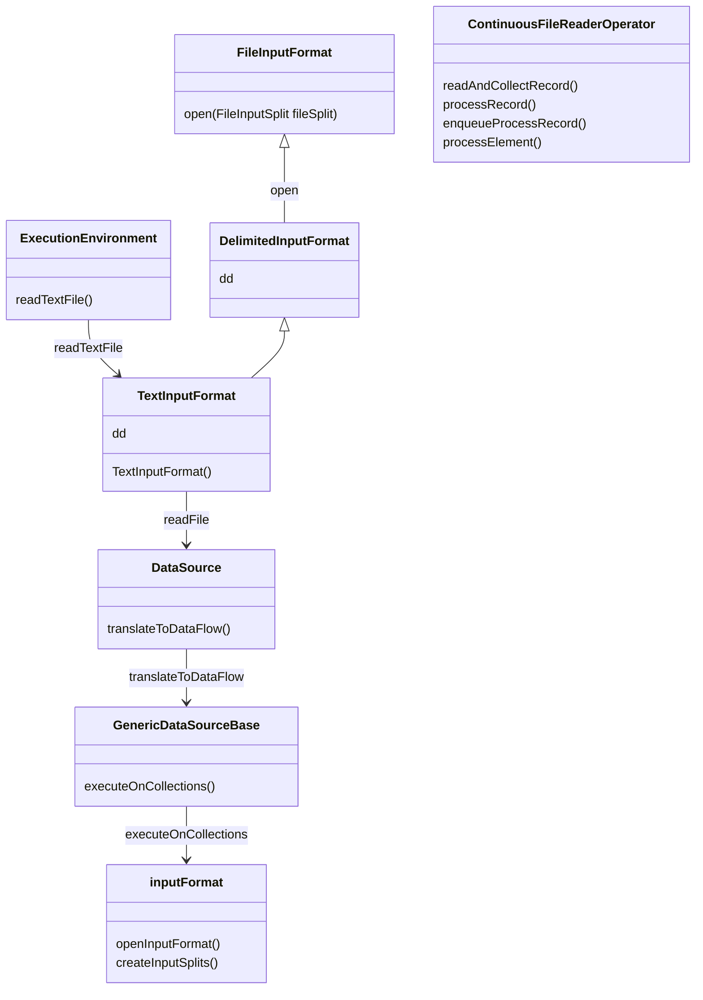
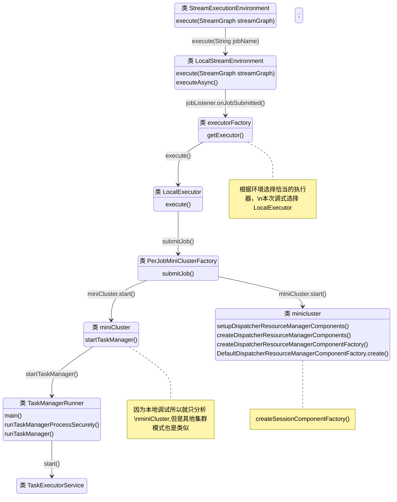
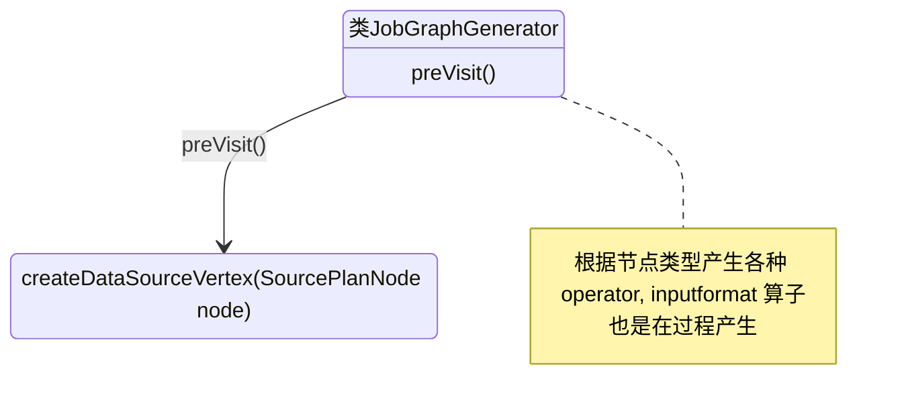

## StreamExecutionEnvironment::readFile(FileInputFormat<OUT> inputFormat,
        String filePath,
        FileProcessingMode watchType,
        long interval,
        TypeInformation<OUT> typeInformation) 分析

外部接口如ReadTextFile()等函数的核心入口就是调用 readFile() 函数




## ExecutionEnviroment::readTextFile 创建 DataSource 分析



**注意：**

+ openInputFormat() 一个并行实例只打开一次


```mermaid
sequenceDiagram
StreamExecutionEnvironment ->> execute:execute
execute ->> getStreamGraph:getStreamGraph
LocalExecutor ->> getJobGraph:PipelineExecutorUtils.getJobGraph
getMiniClusterConfig ->> MiniClusterConfiguration.Builder():build()
createFileInput ->> monitoringFunction :createFileInput
```

## MiniCluster 启动模式分析

Flink 提供用户本地调式的机制那就是 MiniCluster，该对象会启动 jobmanager, taskManager 等组件。

根据 是否是本地模式，启动 LocalExecutor 来启动 MiniCluster 

org.apache.flink.runtime.taskexecutor.TaskManagerRunner 就是 TaskManager 进程的入口




## JobGraphGenerator:: preVisit() 分析job图生成



#### Flink jobManager/TaskManager 启动分析

+ start-cluster.sh 启动本地 flink 集群，该脚本调用 jobmanager.sh 脚本

  ```bash
  # jobmanager.sh 脚本 指定 jobmanager 入口类
  ENTRYPOINT=standalonesession
  ```
  
+  jobmanager.sh 脚本 调用 flink-daemon.sh 或者 flink-console.sh（前台执行）脚本启动 jobmanager

+ 启动脚本 flink-1.12.2/bin/flink-console.sh (前台启动)，flink-1.12.2/bin/flink-daemon.sh(后台启动)，核心脚本的入口代码如下：

  ```bash
  case $DAEMON in
  	# TaskManager 入口
      (taskexecutor)
          CLASS_TO_RUN=org.apache.flink.runtime.taskexecutor.TaskManagerRunner
      ;;
  
      (zookeeper)
          CLASS_TO_RUN=org.apache.flink.runtime.zookeeper.FlinkZooKeeperQuorumPeer
      ;;
  
      (historyserver)
          CLASS_TO_RUN=org.apache.flink.runtime.webmonitor.history.HistoryServer
      ;;
      # JobManager 入口
  
      (standalonesession)
          CLASS_TO_RUN=org.apache.flink.runtime.entrypoint.StandaloneSessionClusterEntrypoint
      ;;
      # JobManager 入口
  
      (standalonejob)
          CLASS_TO_RUN=org.apache.flink.container.entrypoint.StandaloneApplicationClusterEntryPoint
      ;;
  
      (*)
          echo "Unknown daemon '${DAEMON}'. $USAGE."
          exit 1
      ;;
  esac
  ```

+ 

+ org.apache.flink.container.entrypoint.StandaloneApplicationClusterEntryPoint 类启动

  ClusterEntrypoint 类 createDispatcherResourceManagerComponentFactory 方法实现，该方法返回DefaultDispatcherResourceManagerComponentFactory 对象。这个对象核心方法是 create，包括 resourceManager，dispatcherRunner，webMonitorEndpoint 等等多个重要组件创建的活动。

  ```java
  /** Entry point for the standalone session cluster. */
  public class StandaloneSessionClusterEntrypoint extends SessionClusterEntrypoint {
  
      public StandaloneSessionClusterEntrypoint(Configuration configuration) {
          super(configuration);
      }
  
      // ClusterEntrypoint 类 createDispatcherResourceManagerComponentFactory 方法实现
      @Override
      protected DefaultDispatcherResourceManagerComponentFactory
              createDispatcherResourceManagerComponentFactory(Configuration configuration) {
          return DefaultDispatcherResourceManagerComponentFactory.createSessionComponentFactory(
                  StandaloneResourceManagerFactory.getInstance());
      }
  
      public static void main(String[] args) {
          // startup checks and logging
          EnvironmentInformation.logEnvironmentInfo(
                  LOG, StandaloneSessionClusterEntrypoint.class.getSimpleName(), args);
          SignalHandler.register(LOG);
          JvmShutdownSafeguard.installAsShutdownHook(LOG);
  
          final EntrypointClusterConfiguration entrypointClusterConfiguration =
                  ClusterEntrypointUtils.parseParametersOrExit(
                          args,
                          new EntrypointClusterConfigurationParserFactory(),
                          StandaloneSessionClusterEntrypoint.class);
          Configuration configuration = loadConfiguration(entrypointClusterConfiguration);
  
          StandaloneSessionClusterEntrypoint entrypoint =
                  new StandaloneSessionClusterEntrypoint(configuration);
  
          // 程序入口调用
          ClusterEntrypoint.runClusterEntrypoint(entrypoint);
      }
  }
  ```

+ ClusterEntrypoint 类调用静态方法 runClusterEntrypoint  方法 

  ```java
  public static void runClusterEntrypoint(ClusterEntrypoint clusterEntrypoint) {
  // ... 忽略
  clusterEntrypoint.startCluster();
  // ... 忽略
  }
  ```

+ ClusterEntrypoint 再调用 startCluster 方法

  ```java
  public void startCluster() throws ClusterEntrypointException {
      // ... 忽略 ，安装安全模块等内容
                  securityContext.runSecured(
                      (Callable<Void>)
                              () -> {
                                  // 启动集群
                                  runCluster(configuration, pluginManager);
  
                                  return null;
                              });
      
      // ... 忽略，异常处理
  }
  ```

  

+ ClusterEntrypoint 继续调用 

  ```java
  private void runCluster(Configuration configuration, PluginManager pluginManager)
          throws Exception {
      // ... 忽略，创建辅助服务，如 ioExecutor, haServices等
                  clusterComponent =
                      dispatcherResourceManagerComponentFactory.create(
                              configuration,
                              ioExecutor,
                              commonRpcService,
                              haServices,
                              blobServer,
                              heartbeatServices,
                              metricRegistry,
                              archivedExecutionGraphStore,
                              new RpcMetricQueryServiceRetriever(
                                      metricRegistry.getMetricQueryServiceRpcService()),
                              this);
      // ... 忽略
  }
  ```

 

## Flink 命令行提交分析（flink-clients 包分析）

### 1. 提交点 flink run xxxx

+ 脚本所在位置

  ```bash
  # ./bin/flink 脚本
  
  exec $JAVA_RUN $JVM_ARGS $FLINK_ENV_JAVA_OPTS "${log_setting[@]}" -classpath "`manglePathList "$CC_CLASSPATH:$INTERNAL_HADOOP_CLASSPATHS"`" org.apache.flink.client.cli.CliFrontend "$@"
  
  关键调用了 org.apache.flink.client.cli.CliFrontend 类
  ```

+ 核心方法是CliFrontend 类的 main方法

  ```java
  			
  SecurityUtils.install(new SecurityConfiguration(cli.configuration));
  			int retCode = SecurityUtils.getInstalledContext()
  					.runSecured(() -> cli.parseParameters(args));
  			System.exit(retCode);
  
  // cli.parseParameters(args) 方法是具体解析提交的参数，执行不同的任务提交方式
  ```

+ 跟进 parseParameters(args) 方法

  ```java
  			// do action
  			switch (action) {
  				case ACTION_RUN:
  					run(params);
  					return 0;
  				case ACTION_RUN_APPLICATION:
  					runApplication(params);
  					return 0;
  				case ACTION_LIST:
  					list(params);
  					return 0;
  				case ACTION_INFO:
  					info(params);
  					return 0;
  				case ACTION_CANCEL:
  					cancel(params);
  					return 0;
  				case ACTION_STOP:
  					stop(params);
  					return 0;
  				case ACTION_SAVEPOINT:
  					savepoint(params);
  					return 0;
  				case "-h":
  				case "--help":
  ```

+ run(); --> getPackagedProgram(programOptions); --> program = buildProgram(programOptions);

  ```java
  // buildProgram(programOptions);
  // 该方法里面 利用 PackagedProgram 构造程序，重要工作是根据命令行参数的入口类来打包程序
  return PackagedProgram.newBuilder()
  			.setJarFile(jarFile)
  			.setUserClassPaths(classpaths)
  			.setEntryPointClassName(entryPointClass)
  			.setConfiguration(configuration)
  			.setSavepointRestoreSettings(runOptions.getSavepointRestoreSettings())
  			.setArguments(programArgs)
  			.build();
  ```

+ run(); --> executeProgram() --> program.invokeInteractiveModeForExecution(); 启动程序执行

  ```java
  // 采用 DefaultExecutorServiceLoader	 来创建 服务加载器
  protected void executeProgram(final Configuration configuration, final PackagedProgram program) throws ProgramInvocationException {
  		ClientUtils.executeProgram(new DefaultExecutorServiceLoader(), configuration, program, false, false);
  	}
  
  // program.invokeInteractiveModeForExecution(); 方法来执行任务
  
  	public static void executeProgram(
  			PipelineExecutorServiceLoader executorServiceLoader,
  			Configuration configuration,
  			PackagedProgram program,
  			boolean enforceSingleJobExecution,
  			boolean suppressSysout) throws ProgramInvocationException {
  		checkNotNull(executorServiceLoader);
  		final ClassLoader userCodeClassLoader = program.getUserCodeClassLoader();
  		final ClassLoader contextClassLoader = Thread.currentThread().getContextClassLoader();
  		try {
  			Thread.currentThread().setContextClassLoader(userCodeClassLoader);
  
  			LOG.info("Starting program (detached: {})", !configuration.getBoolean(DeploymentOptions.ATTACHED));
  
  			ContextEnvironment.setAsContext(
  				executorServiceLoader,
  				configuration,
  				userCodeClassLoader,
  				enforceSingleJobExecution,
  				suppressSysout);
  
  			StreamContextEnvironment.setAsContext(
  				executorServiceLoader,
  				configuration,
  				userCodeClassLoader,
  				enforceSingleJobExecution,
  				suppressSysout);
  
  			try {
  				program.invokeInteractiveModeForExecution();
  			} finally {
  				ContextEnvironment.unsetAsContext();
  				StreamContextEnvironment.unsetAsContext();
  			}
  		} finally {
  			Thread.currentThread().setContextClassLoader(contextClassLoader);
  		}
  	}
  ```

+ 继续追踪 packagedProgram::invokeInteractiveModeForExecution()

  ```java
  	public void invokeInteractiveModeForExecution() throws ProgramInvocationException {
  		callMainMethod(mainClass, args);
  	}
  
  
      private static void callMainMethod(Class<?> entryClass, String[] args)
              throws ProgramInvocationException {
          // ...
                  try {
                      // 执行 作业的 main 方法
              mainMethod.invoke(null, (Object) args);
                      
          } catch (IllegalArgumentException e) {
              throw new ProgramInvocationException(
                      "Could not invoke the main method, arguments are not matching.", e);
          } catch (IllegalAccessException e) {
              throw new ProgramInvocationException(
                      "Access to the main method was denied: " + e.getMessage(), e);
          } catch (InvocationTargetException e) {
              Throwable exceptionInMethod = e.getTargetException();
              if (exceptionInMethod instanceof Error) {
                  throw (Error) exceptionInMethod;
              } else if (exceptionInMethod instanceof ProgramParametrizationException) {
                  throw (ProgramParametrizationException) exceptionInMethod;
              } else if (exceptionInMethod instanceof ProgramInvocationException) {
                  throw (ProgramInvocationException) exceptionInMethod;
              } else {
                  throw new ProgramInvocationException(
                          "The main method caused an error: " + exceptionInMethod.getMessage(),
                          exceptionInMethod);
              }
          } catch (Throwable t) {
              throw new ProgramInvocationException(
                      "An error occurred while invoking the program's main method: " + t.getMessage(),
                      t);
          }
          // ...
      }
  ```

  

+ #### run(); --> runApplication() 方法分析 用户提交 run application 模式的任务

  ```java
  	protected void runApplication(String[] args) throws Exception {
  		LOG.info("Running 'run-application' command.");
  
  		final Options commandOptions = CliFrontendParser.getRunCommandOptions();
  		final CommandLine commandLine = getCommandLine(commandOptions, args, true);
  
  		if (commandLine.hasOption(HELP_OPTION.getOpt())) {
  			CliFrontendParser.printHelpForRun(customCommandLines);
  			return;
  		}
  
  		final CustomCommandLine activeCommandLine =
  				validateAndGetActiveCommandLine(checkNotNull(commandLine));
  
  		final ProgramOptions programOptions = new ProgramOptions(commandLine);
  
          // ApplicationClusterDeployer 类向 yarn 提交任务
  		final ApplicationDeployer deployer =
  				new ApplicationClusterDeployer(clusterClientServiceLoader);
  
  		programOptions.validate();
  		final URI uri = PackagedProgramUtils.resolveURI(programOptions.getJarFilePath());
  		final Configuration effectiveConfiguration = getEffectiveConfiguration(
  				activeCommandLine, commandLine, programOptions, Collections.singletonList(uri.toString()));
  		final ApplicationConfiguration applicationConfiguration =
  				new ApplicationConfiguration(programOptions.getProgramArgs(), programOptions.getEntryPointClassName());
  		deployer.run(effectiveConfiguration, applicationConfiguration);
  	}
  ```

+ ApplicationClusterDeployer.run() 方法

  ```java
  	public <ClusterID> void run(
  			final Configuration configuration,
  			final ApplicationConfiguration applicationConfiguration) throws Exception {
  		checkNotNull(configuration);
  		checkNotNull(applicationConfiguration);
  
  		LOG.info("Submitting application in 'Application Mode'.");
  
  		final ClusterClientFactory<ClusterID> clientFactory = clientServiceLoader.getClusterClientFactory(configuration);
          
          // 会根据配置使用工厂类构造不同的ClusterDescriptor，比如是k8s的话会构造KubernetesClusterDescriptor，部署在yarn的话会构造YarnClusterDescriptor
  		try (final ClusterDescriptor<ClusterID> clusterDescriptor = clientFactory.createClusterDescriptor(configuration)) {
  			final ClusterSpecification clusterSpecification = clientFactory.getClusterSpecification(configuration);
  
  // clusterDescriptor 提交 application 
  			clusterDescriptor.deployApplicationCluster(clusterSpecification, applicationConfiguration);
  		}
  	}
  ```


### 2. job main() 函数启动，那么接下去就是 main 函数里的 env.execute() 作业执行工作流分析，入口点就是位于 ExecutionEnvironment::execute() 函数

```java
    public JobExecutionResult execute() throws Exception {
        return execute(getJobName());
    }

    public JobExecutionResult execute(String jobName) throws Exception {
     
        final JobClient jobClient = executeAsync(jobName);
        // ... 忽略其他代码
    }
```

##### 2.1 接下去就分析 executeAysnc() 函数

```java
    public JobClient executeAsync(String jobName) throws Exception {
// 忽略

        CompletableFuture<JobClient> jobClientFuture =
                executorFactory
                        .getExecutor(configuration)
                        .execute(plan, configuration, userClassloader);
        // 忽略
    }

// 跟踪 excute 函数 发现是 PipelineExecutor 接口类的一个方法，于是查看继承关系
// 分析到 AbstractJobClusterExecutor类 该类实现 PipelineExecutor 接口的方法
```

##### 2.2 AbstractJobClusterExecutor::excute() 方法

```java
    @Override
    public CompletableFuture<JobClient> execute(
            @Nonnull final Pipeline pipeline,
            @Nonnull final Configuration configuration,
            @Nonnull final ClassLoader userCodeClassloader)
            throws Exception {
        final JobGraph jobGraph = PipelineExecutorUtils.getJobGraph(pipeline, configuration);

        try (
           	// 创建 集群作业
            final ClusterDescriptor<ClusterID> clusterDescriptor =
                clusterClientFactory.createClusterDescriptor(configuration)) {
            final ExecutionConfigAccessor configAccessor =
                    ExecutionConfigAccessor.fromConfiguration(configuration);

            // 创建 jobmanager,taskmanager, taskslots 等计算、内存资源信息
            final ClusterSpecification clusterSpecification =
                    clusterClientFactory.getClusterSpecification(configuration);

            // 部署作业 deployJobCluster() 方法
            final ClusterClientProvider<ClusterID> clusterClientProvider =
                    clusterDescriptor.deployJobCluster(
                            clusterSpecification, jobGraph, configAccessor.getDetachedMode());
            LOG.info("Job has been submitted with JobID " + jobGraph.getJobID());

            return CompletableFuture.completedFuture(
                    new ClusterClientJobClientAdapter<>(
                            clusterClientProvider, jobGraph.getJobID(), userCodeClassloader));
        }
    }
}
```

##### 2.3 跟踪 部署作业 deployJobCluster() 方法

因为 YarnClusterDescriptor 实现了 ClusterDescriptor  接口，所以直接跟踪 YarnClusterDescriptor::deployJobCluster() 方法

```java
@Override
    public ClusterClientProvider<ApplicationId> deployJobCluster(
            ClusterSpecification clusterSpecification, JobGraph jobGraph, boolean detached)
            throws ClusterDeploymentException {
        try {
            // 跟踪 deployInternal 方法
            return deployInternal(
                    clusterSpecification,
                    "Flink per-job cluster",
                    getYarnJobClusterEntrypoint(),
                    jobGraph,
                    detached);
        } catch (Exception e) {
            throw new ClusterDeploymentException("Could not deploy Yarn job cluster.", e);
        }
    }
```

deployInternal() 方法是向 yarn 提交的核心

```java
private ClusterClientProvider<ApplicationId> deployInternal(
            ClusterSpecification clusterSpecification,
            String applicationName,
            String yarnClusterEntrypoint,
            @Nullable JobGraph jobGraph,
            boolean detached)
            throws Exception {

        final UserGroupInformation currentUser = UserGroupInformation.getCurrentUser();
        if (HadoopUtils.isKerberosSecurityEnabled(currentUser)) {
            boolean useTicketCache =
                    flinkConfiguration.getBoolean(SecurityOptions.KERBEROS_LOGIN_USETICKETCACHE);

            if (!HadoopUtils.areKerberosCredentialsValid(currentUser, useTicketCache)) {
                throw new RuntimeException(
                        "Hadoop security with Kerberos is enabled but the login user "
                                + "does not have Kerberos credentials or delegation tokens!");
            }
        }

        isReadyForDeployment(clusterSpecification);

        // ------------------ Check if the specified queue exists --------------------

        checkYarnQueues(yarnClient);

        // ------------------ Check if the YARN ClusterClient has the requested resources
        // --------------

        // Create application via yarnClient
        final YarnClientApplication yarnApplication = yarnClient.createApplication();
        final GetNewApplicationResponse appResponse = yarnApplication.getNewApplicationResponse();

        Resource maxRes = appResponse.getMaximumResourceCapability();

        final ClusterResourceDescription freeClusterMem;
        try {
            freeClusterMem = getCurrentFreeClusterResources(yarnClient);
        } catch (YarnException | IOException e) {
            failSessionDuringDeployment(yarnClient, yarnApplication);
            throw new YarnDeploymentException(
                    "Could not retrieve information about free cluster resources.", e);
        }

        final int yarnMinAllocationMB =
                yarnConfiguration.getInt(
                        YarnConfiguration.RM_SCHEDULER_MINIMUM_ALLOCATION_MB,
                        YarnConfiguration.DEFAULT_RM_SCHEDULER_MINIMUM_ALLOCATION_MB);
        if (yarnMinAllocationMB <= 0) {
            throw new YarnDeploymentException(
                    "The minimum allocation memory "
                            + "("
                            + yarnMinAllocationMB
                            + " MB) configured via '"
                            + YarnConfiguration.RM_SCHEDULER_MINIMUM_ALLOCATION_MB
                            + "' should be greater than 0.");
        }

        final ClusterSpecification validClusterSpecification;
        try {
            validClusterSpecification =
                    validateClusterResources(
                            clusterSpecification, yarnMinAllocationMB, maxRes, freeClusterMem);
        } catch (YarnDeploymentException yde) {
            failSessionDuringDeployment(yarnClient, yarnApplication);
            throw yde;
        }

        LOG.info("Cluster specification: {}", validClusterSpecification);

        final ClusterEntrypoint.ExecutionMode executionMode =
                detached
                        ? ClusterEntrypoint.ExecutionMode.DETACHED
                        : ClusterEntrypoint.ExecutionMode.NORMAL;

        flinkConfiguration.setString(ClusterEntrypoint.EXECUTION_MODE, executionMode.toString());

    	// 验证好 yarn 所需最小资源，开始启动 yarn app master
    	// 跟踪该函数
        ApplicationReport report =
                startAppMaster(
                        flinkConfiguration,
                        applicationName,
                        yarnClusterEntrypoint,
                        jobGraph,
                        yarnClient,
                        yarnApplication,
                        validClusterSpecification);

        // print the application id for user to cancel themselves.
        if (detached) {
            final ApplicationId yarnApplicationId = report.getApplicationId();
            logDetachedClusterInformation(yarnApplicationId, LOG);
        }

        setClusterEntrypointInfoToConfig(report);

        return () -> {
            try {
                return new RestClusterClient<>(flinkConfiguration, report.getApplicationId());
            } catch (Exception e) {
                throw new RuntimeException("Error while creating RestClusterClient.", e);
            }
        };
    }
```

继续 startAppMaster() 方法

```java
startAppMaster() {
  // 忽略 上面代码
    final JobManagerProcessSpec processSpec =
                JobManagerProcessUtils.processSpecFromConfigWithNewOptionToInterpretLegacyHeap(
                        flinkConfiguration, JobManagerOptions.TOTAL_PROCESS_MEMORY);
    
    // 启动 ApplicationMaster 容器
        final ContainerLaunchContext amContainer =
                setupApplicationMasterContainer(yarnClusterEntrypoint, hasKrb5, processSpec);
    
    // ...
    // 提交应用程序到 yarn
    yarnClient.submitApplication(appContext);
    //...
    
    // 忽略 后面代码
}      
```

##### 2.3 上面代码是向 yarn 提交 用户代码 ，接着 yarn application container 要启动 yarn 类型的作业所需要的组件 如，resource manager, dispatcher, JobMaster，需要分析 YarnJobClusterEntrypoint 类的 main() 方法

```java
ClusterEntrypoint.runClusterEntrypoint(yarnJobClusterEntrypoint);
```

跟进 runClusterEntrypoint()

```java
clusterEntrypoint.startCluster();
// 跟进 startCluster核心代码是 runCluster()
private void runCluster(Configuration configuration, PluginManager pluginManager)
            throws Exception {
        synchronized (lock) {
            initializeServices(configuration, pluginManager);

            // write host information into configuration
            configuration.setString(JobManagerOptions.ADDRESS, commonRpcService.getAddress());
            configuration.setInteger(JobManagerOptions.PORT, commonRpcService.getPort());

            final DispatcherResourceManagerComponentFactory
                    dispatcherResourceManagerComponentFactory =

                // 该方法 创建 DefaultDispatcherResourceManagerComponentFactory 对象，
 // 该方法在 YarnJobClusterEntrypoint 类中实现
 // YarnJobClusterEntrypoint 继承 JobClusterEntrypoint ,
 //  JobClusterEntrypoint 继承 ClusterEntrypoint  
//  ClusterEntrypoint 类有一个 createDispatcherResourceManagerComponentFactory  抽象方法

                createDispatcherResourceManagerComponentFactory(configuration);
                

            // DefaultDispatcherResourceManagerComponentFactory 对象的create 创建 包含 Dispatcher,ResourceManager,JobMaster 对象。
            clusterComponent =
                    dispatcherResourceManagerComponentFactory.create(
                            configuration,
                            ioExecutor,
                            commonRpcService,
                            haServices,
                            blobServer,
                            heartbeatServices,
                            metricRegistry,
                            archivedExecutionGraphStore,
                            new RpcMetricQueryServiceRetriever(
                                    metricRegistry.getMetricQueryServiceRpcService()),
                            this);

            clusterComponent
                    .getShutDownFuture()
                    .whenComplete(
                            (ApplicationStatus applicationStatus, Throwable throwable) -> {
                                if (throwable != null) {
                                    shutDownAsync(
                                            ApplicationStatus.UNKNOWN,
                                            ExceptionUtils.stringifyException(throwable),
                                            false);
                                } else {
                                    // This is the general shutdown path. If a separate more
                                    // specific shutdown was
                                    // already triggered, this will do nothing
                                    shutDownAsync(applicationStatus, null, true);
                                }
                            });
        }
    }
```

具体看一下 dispatcherResourceManagerComponentFactory.create() 方法

```java
 public DispatcherResourceManagerComponent create(
            Configuration configuration,
            Executor ioExecutor,
            RpcService rpcService,
            HighAvailabilityServices highAvailabilityServices,
            BlobServer blobServer,
            HeartbeatServices heartbeatServices,
            MetricRegistry metricRegistry,
            ArchivedExecutionGraphStore archivedExecutionGraphStore,
            MetricQueryServiceRetriever metricQueryServiceRetriever,
            FatalErrorHandler fatalErrorHandler)
            throws Exception {
     
     // 忽略
     
     // 创建 yarn 上的 flink 的 resourceManager 组件 而不是 yarn 的 resource manager 组件
     resourceManager =
                    resourceManagerFactory.createResourceManager(
                            configuration,
                            ResourceID.generate(),
                            rpcService,
                            highAvailabilityServices,
                            heartbeatServices,
                            fatalErrorHandler,
                            new ClusterInformation(hostname, blobServer.getPort()),
                            webMonitorEndpoint.getRestBaseUrl(),
                            metricRegistry,
                            hostname,
                            ioExecutor);

            final HistoryServerArchivist historyServerArchivist =
                    HistoryServerArchivist.createHistoryServerArchivist(
                            configuration, webMonitorEndpoint, ioExecutor);

            final PartialDispatcherServices partialDispatcherServices =
                    new PartialDispatcherServices(
                            configuration,
                            highAvailabilityServices,
                            resourceManagerGatewayRetriever,
                            blobServer,
                            heartbeatServices,
                            () ->
                                    MetricUtils.instantiateJobManagerMetricGroup(
                                            metricRegistry, hostname),
                            archivedExecutionGraphStore,
                            fatalErrorHandler,
                            historyServerArchivist,
                            metricRegistry.getMetricQueryServiceGatewayRpcAddress(),
                            ioExecutor);

     // 创建、并启动 DisPatcher 
            log.debug("Starting Dispatcher.");
            dispatcherRunner =
                    dispatcherRunnerFactory.createDispatcherRunner(
                            highAvailabilityServices.getDispatcherLeaderElectionService(),
                            fatalErrorHandler,
                            new HaServicesJobGraphStoreFactory(highAvailabilityServices),
                            ioExecutor,
                            rpcService,
                            partialDispatcherServices);

            log.debug("Starting ResourceManager.");
            resourceManager.start();

            resourceManagerRetrievalService.start(resourceManagerGatewayRetriever);
            dispatcherLeaderRetrievalService.start(dispatcherGatewayRetriever);

            return new DispatcherResourceManagerComponent(
                    dispatcherRunner,
                    DefaultResourceManagerService.createFor(resourceManager),
                    dispatcherLeaderRetrievalService,
                    resourceManagerRetrievalService,
                    webMonitorEndpoint,
                    fatalErrorHandler);
     // 忽略
 }
```

跟进 resourceManagerFactory.createResourceManager()  --> ResourceManagerFactory::createResourceManager() --> ActiveResourceManagerFactory::createResourceManager() -> new ActiveResourceManager(...) --> 核心逻辑在 ResourceManager 构造函数。flink 本身的 resource manager 分析到此为止。

**接下来分析 dispatcher 的创建过程**

dispatcherRunnerFactory.createDispatcherRunner() 函数，

DefaultDispatcherRunnerFactory::createDispatcherRunner() 方法实现了dispatcherRunnerFactory的接口

```java
DefaultDispatcherRunner::create() -- > DispatcherRunnerLeaderElectionLifecycleManager::createFor() --> new DispatcherRunnerLeaderElectionLifecycleManager(...)


    private DispatcherRunnerLeaderElectionLifecycleManager(
            T dispatcherRunner, LeaderElectionService leaderElectionService) throws Exception {
        this.dispatcherRunner = dispatcherRunner;
        this.leaderElectionService = leaderElectionService;

        leaderElectionService.start(dispatcherRunner);
    }
```

跟进 leaderEletionService.start()

```java
// 
StandaloneLeaderElectionService::start()；
    
    
        public void start(LeaderContender newContender) throws Exception {
        if (contender != null) {
            // Service was already started
            throw new IllegalArgumentException(
                    "Leader election service cannot be started multiple times.");
        }

        contender = Preconditions.checkNotNull(newContender);

        // directly grant leadership to the given contender
        contender.grantLeadership(HighAvailabilityServices.DEFAULT_LEADER_ID);
    }

// 跟进 contender.grantLeadership()

// 在 DefaultDispachterRunner::grantLeadership() 方法
   @Override
    public void grantLeadership(UUID leaderSessionID) {
        runActionIfRunning(() -> startNewDispatcherLeaderProcess(leaderSessionID));
    }

    private void startNewDispatcherLeaderProcess(UUID leaderSessionID) {
        stopDispatcherLeaderProcess();

        dispatcherLeaderProcess = createNewDispatcherLeaderProcess(leaderSessionID);

        final DispatcherLeaderProcess newDispatcherLeaderProcess = dispatcherLeaderProcess;
        FutureUtils.assertNoException(
                previousDispatcherLeaderProcessTerminationFuture.thenRun(
                        newDispatcherLeaderProcess::start));
    }

// 跟进 newDispatcherLeaderProcess::start() 实现在 AbstractDispatcherLeaderProcess::start()方法里，看一下该方法内容
    @Override
    public final void start() {
        runIfStateIs(State.CREATED, this::startInternal);
    }

    private void startInternal() {
        log.info("Start {}.", getClass().getSimpleName());
        state = State.RUNNING;
        // 该方法的实现在子类 JobDispatcherLeaderProcess::onStart() 方法
        onStart();
    }

// 继续 JobDispatcherLeaderProcess::onStart() 方法
    @Override
    protected void onStart() {
        final DispatcherGatewayService dispatcherService =
            // 跟进看看
                dispatcherGatewayServiceFactory.create(
                        DispatcherId.fromUuid(getLeaderSessionId()),
                        Collections.singleton(jobGraph),
                        ThrowingJobGraphWriter.INSTANCE);

        completeDispatcherSetup(dispatcherService);
    }

// 查看 dispatcherGatewayServiceFactory.create() 方法 真正实现位于 DefaultDispatcherGatewayServiceFactory::create()
    @Override
    public AbstractDispatcherLeaderProcess.DispatcherGatewayService create(
            DispatcherId fencingToken,
            Collection<JobGraph> recoveredJobs,
            JobGraphWriter jobGraphWriter) {

        final Dispatcher dispatcher;
        try {
            // 真正创建 Dispatcher 
            dispatcher =
                    dispatcherFactory.createDispatcher(
                            rpcService,
                            fencingToken,
                            recoveredJobs,
                            (dispatcherGateway, scheduledExecutor, errorHandler) ->
                                    new NoOpDispatcherBootstrap(),
                            PartialDispatcherServicesWithJobGraphStore.from(
                                    partialDispatcherServices, jobGraphWriter));
        } catch (Exception e) {
            throw new FlinkRuntimeException("Could not create the Dispatcher rpc endpoint.", e);
        }

        // 启动 dispatcher
        dispatcher.start();

        return DefaultDispatcherGatewayService.from(dispatcher);
    }

//  跟踪 dispatcher.start();
// 是启动一个 RPC 服务，真正做事情的是 Dispatcher 类的    onStart() 方法
@Override
    public void onStart() throws Exception {
        try {
            // 启动 Dispatcher 服务
            startDispatcherServices();
        } catch (Throwable t) {
            final DispatcherException exception =
                    new DispatcherException(
                            String.format("Could not start the Dispatcher %s", getAddress()), t);
            onFatalError(exception);
            throw exception;
        }

        // 启动 job master
        startRecoveredJobs();
        this.dispatcherBootstrap =
                this.dispatcherBootstrapFactory.create(
                        getSelfGateway(DispatcherGateway.class),
                        this.getRpcService().getScheduledExecutor(),
                        this::onFatalError);
    }
// 跟进 startRecoveredJobs();
    private void startRecoveredJobs() {
        for (JobGraph recoveredJob : recoveredJobs) {
            // 运行 JobGraph
            runRecoveredJob(recoveredJob);
        }
        recoveredJobs.clear();
    }

    private void runRecoveredJob(final JobGraph recoveredJob) {
        checkNotNull(recoveredJob);
        try {
            // 跟进 runJob()
            runJob(recoveredJob, ExecutionType.RECOVERY);
        } catch (Throwable throwable) {
            onFatalError(
                    new DispatcherException(
                            String.format(
                                    "Could not start recovered job %s.", recoveredJob.getJobID()),
                            throwable));
        }
    }
// 跟进 runJob()
private void runJob(JobGraph jobGraph, ExecutionType executionType) {
        Preconditions.checkState(!runningJobs.containsKey(jobGraph.getJobID()));
        long initializationTimestamp = System.currentTimeMillis();
    
    // 跟进 createJobManagerRunner()
        CompletableFuture<JobManagerRunner> jobManagerRunnerFuture =
                createJobManagerRunner(jobGraph, initializationTimestamp);

        DispatcherJob dispatcherJob =
                DispatcherJob.createFor(
                        jobManagerRunnerFuture,
                        jobGraph.getJobID(),
                        jobGraph.getName(),
                        initializationTimestamp);
        runningJobs.put(jobGraph.getJobID(), dispatcherJob);

      // 忽略后面代码
    }

// 跟进 createJobManagerRunner()
CompletableFuture<JobManagerRunner> createJobManagerRunner(
            JobGraph jobGraph, long initializationTimestamp) {
        final RpcService rpcService = getRpcService();
        return CompletableFuture.supplyAsync(
                () -> {
                    try {
                        // 在一个线程里：创建 并运行 JobManager 
                        JobManagerRunner runner =
                                jobManagerRunnerFactory.createJobManagerRunner(
                                        jobGraph,
                                        configuration,
                                        rpcService,
                                        highAvailabilityServices,
                                        heartbeatServices,
                                        jobManagerSharedServices,
                                        new DefaultJobManagerJobMetricGroupFactory(
                                                jobManagerMetricGroup),
                                        fatalErrorHandler,
                                        initializationTimestamp);
                        runner.start();
                        return runner;
                    } catch (Exception e) {
                        throw new CompletionException(
                                new JobInitializationException(
                                        jobGraph.getJobID(),
                                        "Could not instantiate JobManager.",
                                        e));
                    }
                },
                ioExecutor); // do not use main thread executor. Otherwise, Dispatcher is blocked on
        // JobManager creation
    }

// 分析 DefaultJobManagerRunnerFactory::createJobManagerRunner()
    @Override
    public JobManagerRunner createJobManagerRunner(...) {

        // 以上代码忽略
        return new JobManagerRunnerImpl(
                jobGraph,
                jobMasterFactory,
                highAvailabilityServices,
                jobManagerServices
                        .getLibraryCacheManager()
                        .registerClassLoaderLease(jobGraph.getJobID()),
                jobManagerServices.getScheduledExecutorService(),
                fatalErrorHandler,
                initializationTimestamp);
    }

// 跟进 JobManagerRunnerImpl()
    public JobManagerRunnerImpl(
            final JobGraph jobGraph,
            final JobMasterServiceFactory jobMasterFactory,
            final HighAvailabilityServices haServices,
            final LibraryCacheManager.ClassLoaderLease classLoaderLease,
            final Executor executor,
            final FatalErrorHandler fatalErrorHandler,
            long initializationTimestamp)
            throws Exception {
        
           // now start the JobManager
            this.jobMasterService =
                    jobMasterFactory.createJobMasterService(
                            jobGraph, this, userCodeLoader, initializationTimestamp);
    }

// 跟进 createJobMasterService() 具体实现在 DefaultJobMasterServiceFactory类
    @Override
    public JobMaster createJobMasterService(
            JobGraph jobGraph,
            OnCompletionActions jobCompletionActions,
            ClassLoader userCodeClassloader,
            long initializationTimestamp)
            throws Exception {

       // 创建 JobMaster对象 这里又变成 JobMaster 对象了
        // 前面叫 jobManager 后面就变成 JobMaster 前后概念不一致
        return new JobMaster(
                rpcService,
                jobMasterConfiguration,
                ResourceID.generate(),
                jobGraph,
                haServices,
                slotPoolFactory,
                jobManagerSharedServices,
                heartbeatServices,
                jobManagerJobMetricGroupFactory,
                jobCompletionActions,
                fatalErrorHandler,
                userCodeClassloader,
                schedulerNGFactory,
                shuffleMaster,
                lookup ->
                        new JobMasterPartitionTrackerImpl(
                                jobGraph.getJobID(), shuffleMaster, lookup),
                new DefaultExecutionDeploymentTracker(),
                DefaultExecutionDeploymentReconciler::new,
                initializationTimestamp);
    }
```

